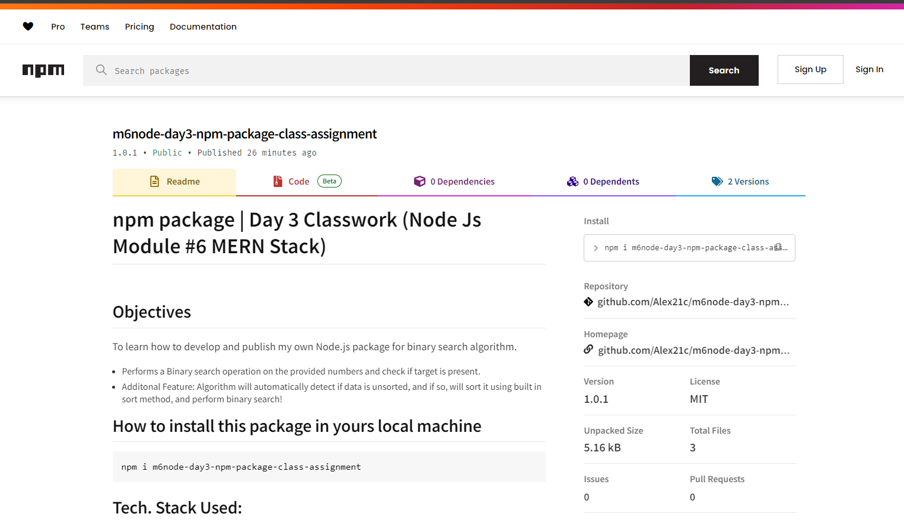

# npm package | Day 3 Classwork (Node Js Module #6 MERN Stack)


## Objectives
To learn how to develop and publish my own Node.js package for binary search algorithm.
 + Performs a Binary search operation on the provided numbers and check if target is present.
 + Additonal Feature: Algorithm will automatically detect if data is unsorted, and if so,  will sort it using built in sort method, and perform binary search!

## How to install this package in yours local machine
```bash
npm i m6node-day3-npm-package-class-assignment
```


## Tech. Stack Used:
+ [NodeJS](https://nodejs.org/en/)

## alex21cBinarySearch 
```javascript
/***
 * Binary Search
 * Performs a Binary search operation on the provided numbers and check if target is present.
 * Additonal Feature: Algorithm will automatically detect if data is unsorted, and if so,
 * will sort it using built in sort method, and perform binary search!
 *
 * @params nums, target 
 * nums: Array of numbers,
 * target: target number
 *
 * @return empty array | idx
 * empty array: if no nums or target is provided
 * idx : index of target otherwise, if not found -1
 *
 * @Time & Space Complexity 
 * Overall Time Complexity (if provided nums are not sorted ): 
 *    O(n log n + log n) = O (n log n)
 * Overall Time Complexity (if provided nums are sorted ):
 *    O (log n)
 * Overall Space Complexity: 
 *  O(1) Not extra space was used
 *
 * Author: Abhishek kumar
 * LinkedIN: https://www.linkedin.com/in/alex21c/
 * Initial Release: May-04-2024
 * License : MIT
 */
```


## Demo examples
```javascript
import alex21cBinarySearch from "m6node-day3-npm-package-class-assignment";
```
in yours package.json file make sure to have 
```json
"type": "module"
```
  
### Example #1: Binary Search on Unsorted Data
```javascript
let nums = [25, 75, 33, 22, 21];
let target = 75;
let idxTarget = alex21cBinarySearch(nums, target)
console.log(`${target} found at index ${idxTarget}, inside [${nums}]`);
```
#### OUTPUT:
```javascript
[ 21, 22, 25, 33, 75 ]
75 found at index 4, inside 21,22,25,33,75
```

### Example #2: Binary Search on Sorted Data
```javascript
let nums = [25, 50, 75, 125, 500, 750];
let target = 35;
let idxTarget = alex21cBinarySearch(nums, target)

if(idxTarget == -1){
  console.log(`${target} Not present, inside [${nums}]`);
}else{
  console.log(`${target} found at index ${idxTarget}, inside [${nums}]`);
}
```
#### OUTPUT: 
```javascript
[ 25, 50, 75, 125, 500, 750 ]
35 Not found , inside [25,50,75,125,500,750]
```

## Author
[Abhishek kumar](https://www.linkedin.com/in/alex21c/), ([Geekster](https://geekster.in/) MERN Stack FS-14 Batch)


  
  
